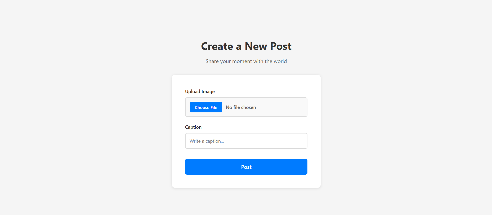

# 📸 Post App (MERN Stack)

A simple full-stack application that allows users to upload an image with a caption and display it as a post.

This project demonstrates real-world handling of file uploads using a cloud storage service instead of storing raw files in the database.

---

## 🚀 Tech Stack

### Frontend

* React.js
* Tailwind CSS

### Backend

* Node.js
* Express.js

### Database

* MongoDB

### Cloud Storage

* ImageKit (for image hosting)

---

## ✨ Features

* Upload image with caption
* Image stored in cloud (ImageKit)
* Only image URL saved in MongoDB
* Display posts with image + caption
* Clean UI using Tailwind

---

## 📷 Screenshots




---

## ⚙️ How It Works

1. User selects an image and writes a caption
2. Image is sent to backend using `FormData`
3. Backend uploads image to ImageKit
4. ImageKit returns a hosted image URL
5. Backend stores:

   * image URL
   * caption
6. Frontend fetches and displays posts

---

## 📂 Folder Structure

```
project/
│
├── frontend/       # React App
│   ├── components/
│   ├── pages/
│   └── App.js
│
├── backend/        # Express Server
│   ├── models/
│   ├── routes/
│   ├── services/
│   └── server.js
│
└── README.md
```

---

## 🔧 Installation

### 1. Clone the repository

```bash
git clone <your-repo-link>
cd project
```

### 2. Setup Backend

```bash
cd backend
npm install
```

Create `.env` file:

```
PORT=5000
MONGO_URI=your_mongodb_connection
IMAGEKIT_PUBLIC_KEY=your_key
IMAGEKIT_PRIVATE_KEY=your_key
IMAGEKIT_URL_ENDPOINT=your_url
```

Run backend:

```bash
npm run dev
```

---

### 3. Setup Frontend

```bash
cd frontend
npm install
npm start
```

---

## 📡 API Endpoint

### Create Post

```
POST /create-post
```

**FormData:**

* image (file)
* caption (string)

---

## 🧠 Key Learning

* Handling file uploads using `multer`
* Using cloud storage instead of saving files locally
* Sending data using `FormData`
* Connecting frontend with backend APIs
* Storing optimized data (URL instead of file)

---

## ⚠️ Limitations

* No authentication
* No user system
* No delete/update post
* No validation for file size/type

---

## 🔮 Future Improvements

* Add authentication (JWT)
* Like & comment system
* Pagination
* Image preview before upload
* Better error handling

---

## 🏁 Conclusion

This project focuses on building a real-world image upload system using MERN stack and cloud storage integration, which is commonly used in production-level applications.

---
